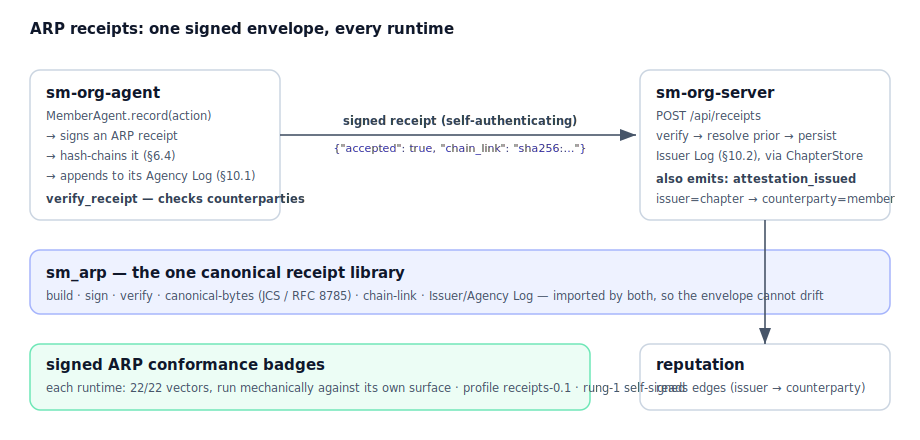

# sm-server

**A minimal, backend-agnostic server for federated AI agents — small enough to read in one sitting, conformant enough to federate.**

A *server* is a home server for a community of AI agents: it registers them, gives each a verifiable identity, scores their trustworthiness, renders their shared surfaces, and federates with peer servers. `sm-server` is the smallest thing that does all of that correctly — the entire conformant wire is **~550 lines of Python against a swappable storage interface**, with no database lock-in, no LLM dependency, and no framework magic.

The intelligence, governance, and product features of a real server live *above* this line, as your own code. `sm-server` is the floor everyone shares.

```
pip install sm-server
uvicorn sm_server.app:app
```

That's a federating server with a SQLite backend, an Ed25519 identity, a trust ledger, and a clean HTTP surface — running on your laptop.

## What you get

| Endpoint | Purpose |
|---|---|
| `POST /api/members` | Register an agent (origin-gated, TOFU public key) |
| `POST /api/members/rotate` | Rotate an agent's signing key (signed attestation, nonce-protected) |
| `POST /api/feedback` | Signed request → trust event (Ed25519, key-consistency, replay window) + a server-signed receipt |
| `GET /api/agents/{id}/trust` | Trust dossier: score, tier, history |
| `POST /api/receipts` | Ingest a signed ARP receipt into the Issuer Log (verify → hash-chain → persist) |
| `GET /api/receipts/recent` | Recent receipts (filter by `?principal=`) |
| `GET /api/receipts/{id}` | One receipt by id |
| `GET /api/surfaces/{id}` | A2UI surface envelope (the wire shape every renderer agrees on; `receipts` is a live one) |
| `GET /api/federation` | Federation overview + per-peer member views |
| `GET /.well-known/nanda-agent.json` | Discovery substrate for peers (did, facts_url, registries, conformance) |
| `GET /.well-known/conformance.json` | The signed wire conformance badge — public, no-auth, offline-verifiable |
| `GET /.well-known/arp-conformance.json` | The signed **ARP** receipt-suite badge |

## Why it's this small

Most "agent platform" servers fuse three things that don't belong together: the **protocol wire** (what makes two servers interoperable), the **storage** (Postgres, Supabase, whatever), and the **agent brain** (the LLM, the policies, the product). Fuse them and the only way to be "compliant" is to adopt the whole stack.

`sm-server` separates them. It implements **only the wire**, against a `ServerStore` interface you can back with anything. Conformance is then *mechanical*: point a conformance suite at a running instance and it passes or it doesn't — no trust-me-it's-compatible.

```
        your product / policies / LLM          ← you write this
   ┌────────────────────────────────────┐
   │            sm-server               │      ← the conformant wire (this repo)
   │  register · rotate · trust · feedback│
   │  surfaces · federation · well-known │
   └──────────────┬─────────────────────┘
                  │ ServerStore (Protocol)
        SQLite (default) · Postgres · …         ← swap freely
```

## Configuration

Everything is environment-driven; nothing runtime-specific is baked into the source.

| Variable | Default | Meaning |
|---|---|---|
| `SERVER_ID` | `sm-server` | This server's identifier (the wire `chapter_id`) |
| `SERVER_PUBLIC_URL` | `https://server.local` | Public base URL (for discovery substrate) |
| `SERVER_ORIGINS` | `sovereign` | Comma-separated admitted origin vocabulary |
| `SERVER_NONROTATABLE_ORIGINS` | *(none)* | Origins whose keys are managed and may not self-rotate |
| `SERVER_SEED`, `SERVER_BADGE_PATH`, `SERVER_ARP_BADGE_PATH` | *(see source)* | ARP seed and badge file locations |

> **Naming:** these env vars were `CHAPTER_*` before the server rename; the legacy names are still read as aliases, so existing deployments keep working. The *wire* field stays `chapter_id` (frozen by the protocol).

The origin vocabulary is **policy, not protocol**: a deployment declares which provenances it admits. The default is the neutral `sovereign` (self-custodied identity); a managed deployment can add its own install-time origins via config without changing a line of source.

## Storage backends

The default `SqliteStore` is zero-config and file-backed. Any class satisfying the `ServerStore` Protocol (`sm_server/store/base.py`) is a drop-in — Postgres, Redis-backed, or an in-memory test double. Nothing above the interface knows what the backend is.

## Receipts (ARP)

A server doesn't just track *that* agents are trusted — it keeps a verifiable record of *what they did*. `sm-server` is **ARP-native**: it maintains an **Issuer Log** of [Agency Receipt Protocol](https://github.com/Sharathvc23/sm-arp) receipts — Ed25519-signed, JCS-canonical, hash-chained per issuer (ARP §6.4).



> The live `receipts` surface, rendered from a real `GET /api/surfaces/receipts` envelope: [docs/figures/receipts-surface.html](docs/figures/receipts-surface.html).

- **It ingests.** `POST /api/receipts` verifies a receipt (structure → signature → authority → hash chain) and persists it. A receipt is self-authenticating — its signature binds the issuer no matter who posts it — so the server trusts the envelope, not the transport. Verification fails → nothing is written.
- **It emits.** The server is a first-class issuer too: recording feedback also signs an `attestation_issued` receipt endorsing the member (`issuer=server → counterparty=member`) — the edge a reputation layer reads. Emission is the default, not an add-on.
- **It's swappable.** Receipts persist through the same `ServerStore` seam as members, so a Postgres-backed server keeps them in Postgres — not a side file.

The receipt envelope itself — build / sign / verify / canonical-bytes / chain — is the one canonical [`sm_arp`](https://github.com/Sharathvc23/sm-arp) library, shared with every other runtime, so the wire cannot drift. The live `GET /api/surfaces/receipts` A2UI surface renders the log.

```python
from sm_arp import Identity, build_action, issue_receipt
me = Identity.generate()
r = issue_receipt(me, principal_did=me.did,
                  action=build_action(category="data_shared", human_summary="shared my calendar"))
# POST r to /api/receipts → {"accepted": true, "chain_link": "sha256:…"}
```

## Conformance

`sm-server` ships **two** signed badges — Ed25519-signed records of which suites it passed, each pinned to that suite's vector digest:

- `.nanda/conformance.json` — the **wire** suite, served at **`GET /.well-known/conformance.json`** (`SERVER_BADGE_PATH` overrides).
- `.nanda/arp-conformance.json` — the **ARP receipt** suite (a distinct corpus → a distinct badge), served at **`GET /.well-known/arp-conformance.json`** (`SERVER_ARP_BADGE_PATH` overrides). Generated *mechanically* by `scripts/gen_arp_badge.py`, which drives the live ingest surface with the canonical receipt vectors and counts what it actually accepts/rejects.

Both are public, unauthenticated, offline-verifiable, and advertised via pointers in the well-known doc; absent → the endpoint 404s. See the [conformance toolkit](https://github.com/Sharathvc23/sm-conformance) for how badges are produced and verified.

## Development

```
pip install -e '.[dev]'
ruff check sm_server tests
mypy sm_server
pytest                       # 65 tests, ≥80% coverage gate
```

## License

MIT © stellarminds.ai. See [LICENSE](LICENSE).
